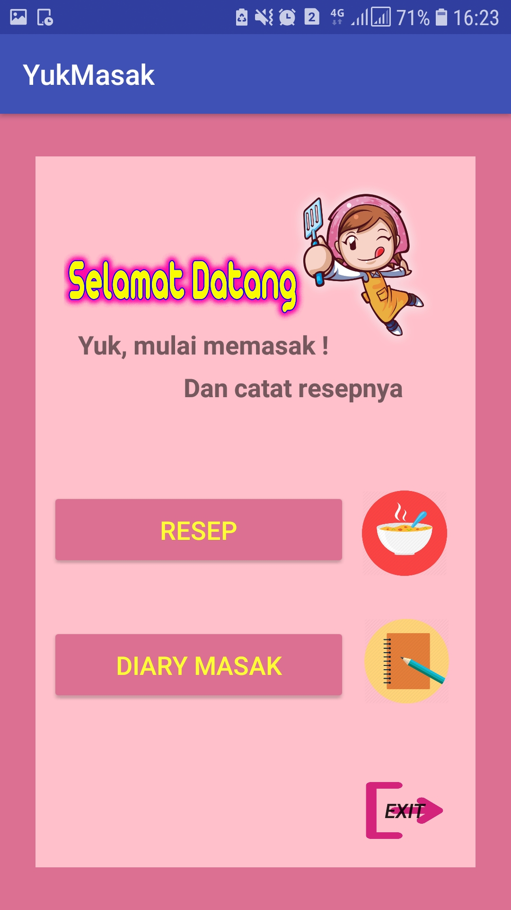
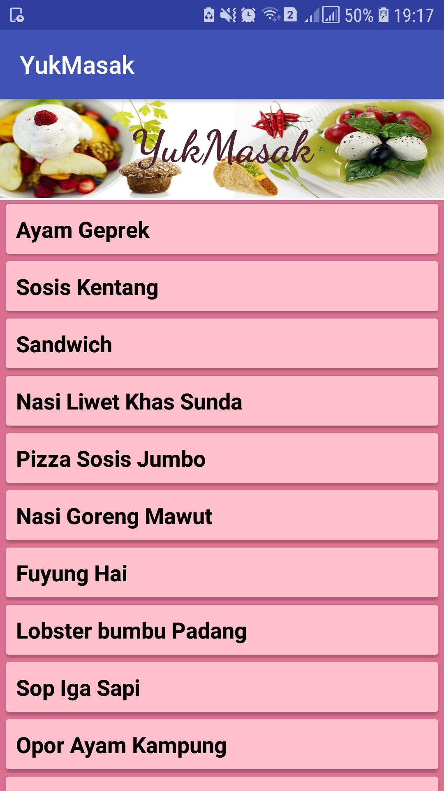
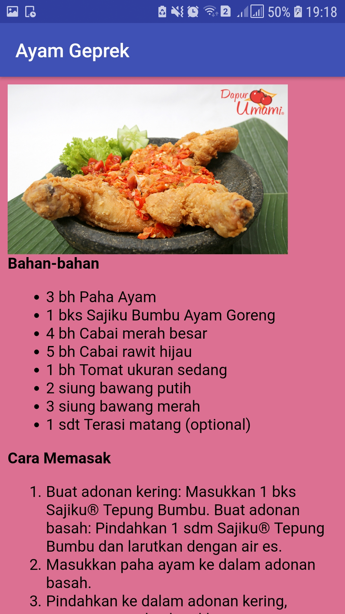
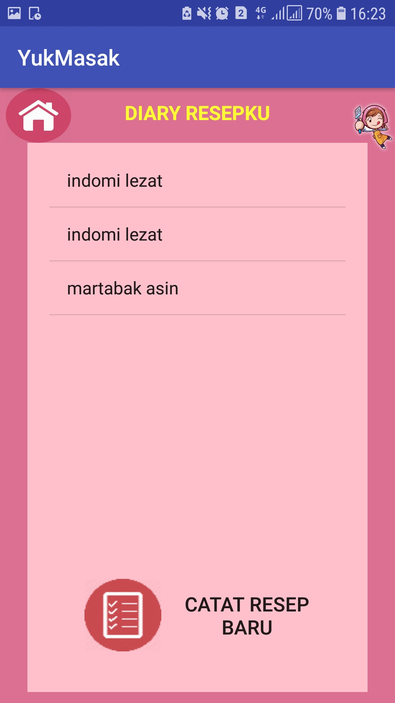
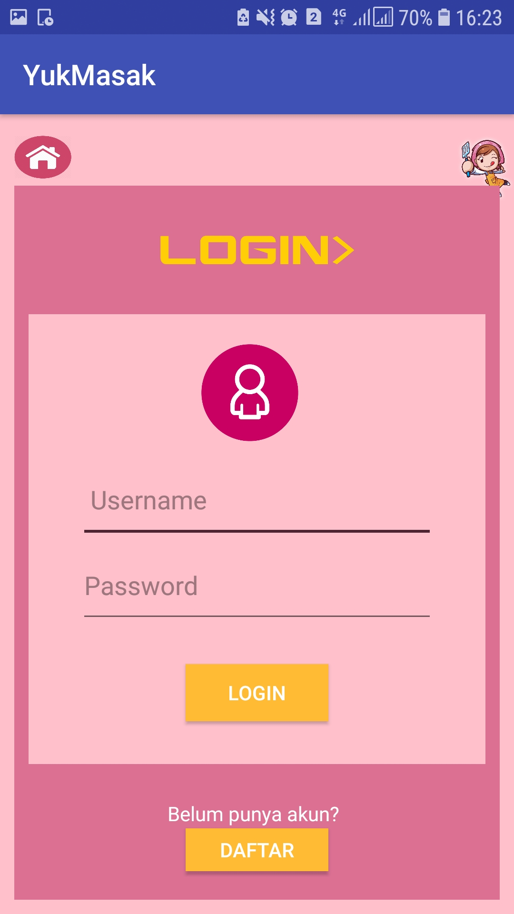
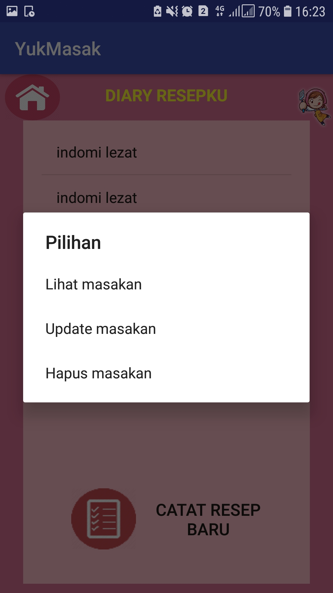

# Hanifah_TI3D
Project akhir android studio (aplikasi resep)

LAPORAN APLIKASI RESEP “YUK MASAK”
Created by Hanifah Fanidya Utari

1.	Tampilan awal

Dihias dengan menggunakan varian gambar.png dan menggunakan layout relative untuk mudah dalam pengaturan, juga button yang diberi background image

2.	Tampilan Beranda

Pada layout ini ditampilkan 2 fungsi utama dari aplikasi “yuk masak”, yaitu resep dan diary masak, dimana resep berisi informasi alat dan bahan dari masakan masakan nusantara, yang diambil melalui url di internet, lalu ada diary masak yang konsep nya menyerupai notes untuk mencatat resep kita sendiri sebagia pengingat

3.	Resep

Fungsi ini dibuat agar user dapat mencari resep dari masakan yang diinginkan atau dicari, tampilan menggunakan array list dengan diinputkan ke dalam button judul masakan yang sesuai

6. Diary masak

Disini adalah fungsi notes atau catatan user untuk menuliskan resep nya, menggunakan database SQL lite, sebelum memasuk diary terdapat fungsi login dan register untuk daftar akun terlebih dahulu

a.	Login dan register

Menggunakan database sql lite

b.	Database

Disini kita juga menggunakan database untuk menginputkan data resep, dan terdapat pilihan untuk read, update, dan delete resep yang diinginkan

